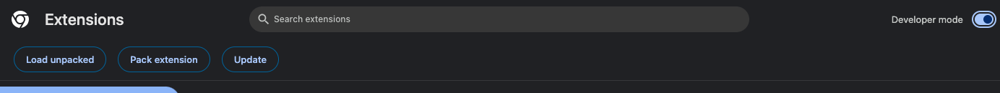

# Getting started
{: .no_toc }

## Installation from Chrome Web Store

Download the AWS Console Bar Chrome Extension from the Chrome Web Store.

## Installation from source

1. Checkout official github repo: [https://github.com/tsypuk/aws-console-bar](https://github.com/tsypuk/aws-console-bar)
2. Enable ``Developer mode`` in Chrome or other browser you plan to use
3. 
4. Click ``Load Unpacked`` and select folder with extension in the Dialog
