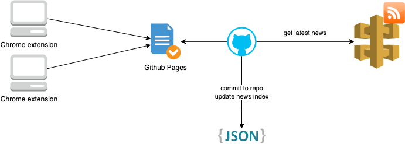
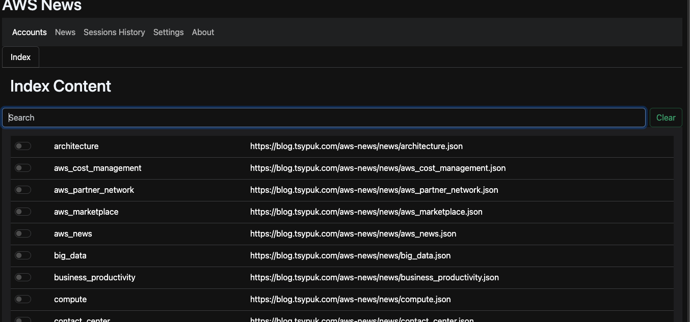
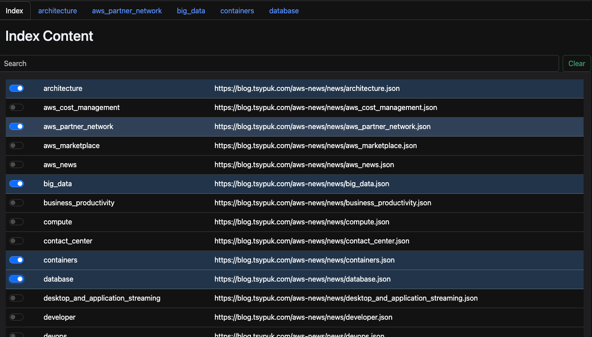
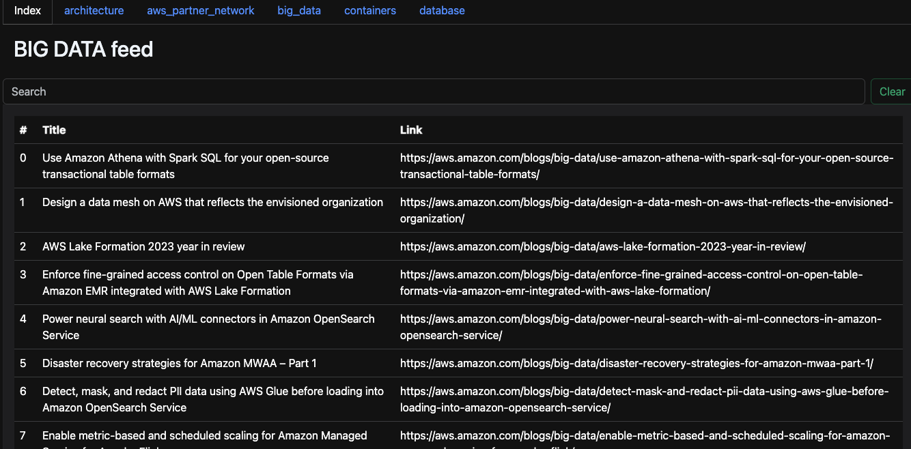
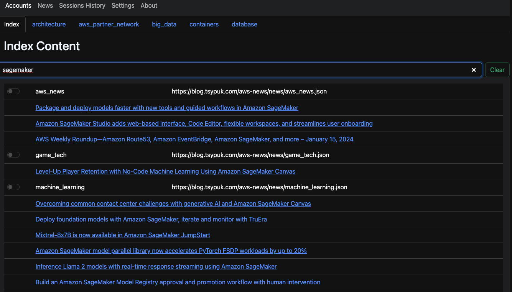

# News Feed
{: .d-inline-block .toc }

New (v1.6.0)
{: .label .label-green }

## Table of contents
{: .no_toc .text-delta }

1. TOC
{:toc}

---

## AWS news

AWS periodically pushes the latest news and updates for its services. ``aws-console-bar`` shows latest news from AWS blog, you can check details and select topic you are interested in.

Following infrastructure is used for crawling and saving news:

All news are stored in gitrepo and publicly available. Repository has schedulled recuring job that gets news, converts from RSS xml format to json and adds link to local git commit.
JSON news are exposed through public endpoint of Githubpages.

## News are rendered at the main bar and periodically updated

## Select your news

To start using news, you need to perform initial configuration and specify you focus of interest.

``aws-console-bar`` allows you to select what topics you are interested in, and news from these topics will be rendered in ``aws-console-bar`` section.

After selecting specific news categories, the TABs on the top will be added for each news category:

You can review what news and articles current feed version includes:

## Full text search in news

On ``Index`` page full text search is working - you can search any word in all feeds and select categories where interesting articles from this topic where included.

## Public AWS RSS feeds (XML-based):

| Name                              | AWS RSS FEED                                                         |
|-----------------------------------|----------------------------------------------------------------------|
| Architecture                      | https://aws.amazon.com/blogs/architecture/feed/                      |
| AWS Cost Management               | https://aws.amazon.com/blogs/aws-cost-management/feed/               |
| AWS Partner Network               | https://aws.amazon.com/blogs/apn/feed/                               |
| AWS Marketplace                   | https://aws.amazon.com/blogs/awsmarketplace/feed/                    |
| AWS News                          | https://aws.amazon.com/blogs/aws/feed/                               |
| Big Data                          | https://aws.amazon.com/blogs/big-data/feed/                          |
| Business Productivity             | https://aws.amazon.com/blogs/business-productivity/feed/             |
| Compute                           | https://aws.amazon.com/blogs/compute/feed/                           |
| Contact Center                    | https://aws.amazon.com/blogs/contact-center/feed/                    |
| Containers                        | https://aws.amazon.com/blogs/containers/feed/                        |
| Database                          | https://aws.amazon.com/blogs/database/feed/                          |
| Desktop and Application Streaming | https://aws.amazon.com/blogs/desktop-and-application-streaming/feed/ |
| Developer                         | https://aws.amazon.com/blogs/developer/feed/                         |
| Devops                            | https://aws.amazon.com/blogs/devops/feed/                            |
| Enterprise Strategy               | https://aws.amazon.com/blogs/enterprise-strategy/feed/               |
| Front-End Web Mobile              | https://aws.amazon.com/blogs/mobile/feed/                            |
| Game Tech                         | https://aws.amazon.com/blogs/gametech/feed/                          |
| HPC                               | https://aws.amazon.com/blogs/hpc/feed/                               |
| Infra and Automation              | https://aws.amazon.com/blogs/infrastructure-and-automation/feed/     |
| Industries                        | https://aws.amazon.com/blogs/industries/feed/                        |
| Internet of things                | https://aws.amazon.com/blogs/iot/feed/                               |
| Machine Learning                  | https://aws.amazon.com/blogs/machine-learning/feed/                  |
| Media                             | https://aws.amazon.com/blogs/mt/feed/                                |
| Messaging and Targeting           | https://aws.amazon.com/blogs/messaging-and-targeting/feed/           |
| Networking And Content Delivery   | https://aws.amazon.com/blogs/networking-and-content-delivery/feed/   |
| Open Source                       | https://aws.amazon.com/blogs/opensource/feed/                        |
| Public Sector                     | https://aws.amazon.com/blogs/publicsector/feed/                      |
| Quantum Computing                 | http://aws.amazon.com/blogs/quantum-computing/feed/                  |
| Robotics                          | https://aws.amazon.com/blogs/robotics/feed/                          |
| SAP                               | https://aws.amazon.com/blogs/awsforsap/feed/                         |
| Security Identity Complience      | https://aws.amazon.com/blogs/security/feed/                          |
| Startups                          | https://aws.amazon.com/blogs/startups/feed/                          |
| Storage                           | https://aws.amazon.com/blogs/storage/feed/                           |
| Training Certification            | https://aws.amazon.com/blogs/training-and-certification/feed/        |
| Windows on AWS                    | https://aws.amazon.com/blogs/modernizing-with-aws/feed/              |

## Converted AWS feeds to JSON

All these files content is crawled with nightly job ``cron: '0 0 * * *'`` and is always up-to-date.

| Name                              | JSON Content                                                                 |
|-----------------------------------|------------------------------------------------------------------------------|
| Architecture                      | https://blog.tsypuk.com/aws-news/news/architecture.json                      |
| AWS Cost Management               | https://blog.tsypuk.com/aws-news/news/aws_cost_management.json               |
| AWS Partner Network               | https://blog.tsypuk.com/aws-news/news/aws_partner_network.json               |
| AWS Marketplace                   | https://blog.tsypuk.com/aws-news/news/aws_marketplace.json                   |
| AWS News                          | https://blog.tsypuk.com/aws-news/news/aws_news.json                          |
| Big Data                          | https://blog.tsypuk.com/aws-news/news/big_data.json                          |
| Business Productivity             | https://blog.tsypuk.com/aws-news/news/business_productivity.json             |
| Compute                           | https://blog.tsypuk.com/aws-news/news/compute.json                           |
| Contact Center                    | https://blog.tsypuk.com/aws-news/news/contact_center.json                    |
| Containers                        | https://blog.tsypuk.com/aws-news/news/containers.json                        |
| Database                          | https://blog.tsypuk.com/aws-news/news/database.json                          |
| Desktop and Application Streaming | https://blog.tsypuk.com/aws-news/news/desktop_and_application_streaming.json |
| Developer                         | https://blog.tsypuk.com/aws-news/news/developer.json                         |
| Devops                            | https://blog.tsypuk.com/aws-news/news/devops.json                            |
| Enterprise Strategy               | https://blog.tsypuk.com/aws-news/news/enterprise_strategy.json               |
| Front-End Web Mobile              | https://blog.tsypuk.com/aws-news/news/front-end_web_mobile.json              |
| Game Tech                         | https://blog.tsypuk.com/aws-news/news/game_tech.json                         |
| HPC                               | https://blog.tsypuk.com/aws-news/news/hpc.json                               |
| Infra and Automation              | https://blog.tsypuk.com/aws-news/news/infra_and_automation.json              |
| Industries                        | https://blog.tsypuk.com/aws-news/news/industries.json                        |
| Internet of things                | https://blog.tsypuk.com/aws-news/news/internet_of_things.json                |
| Machine Learning                  | https://blog.tsypuk.com/aws-news/news/machine_learning.json                  |
| Media                             | https://blog.tsypuk.com/aws-news/news/media.json                             |
| Messaging and Targeting           | https://blog.tsypuk.com/aws-news/news/messaging_and_targeting.json           |
| Networking And Content Delivery   | https://blog.tsypuk.com/aws-news/news/networking_and_content_delivery.json   |
| Open Source                       | https://blog.tsypuk.com/aws-news/news/open_source.json                       |
| Public Sector                     | https://blog.tsypuk.com/aws-news/news/public_sector.json                     |
| Quantum Computing                 | https://blog.tsypuk.com/aws-news/news/quantum_computing.json                 |
| Robotics                          | https://blog.tsypuk.com/aws-news/news/robotics.json                          |
| SAP                               | https://blog.tsypuk.com/aws-news/news/sap.json                               |
| Security Identity Complience      | https://blog.tsypuk.com/aws-news/news/security_identity_complience.json      |
| Startups                          | https://blog.tsypuk.com/aws-news/news/startups.json                          |
| Storage                           | https://blog.tsypuk.com/aws-news/news/storage.json                           |
| Training Certification            | https://blog.tsypuk.com/aws-news/news/training_certification.json            |
| Windows on AWS                    | https://blog.tsypuk.com/aws-news/news/windows_on_aws.json                    |

## News Index:

https://blog.tsypuk.com/aws-news/index.json                    |

Index is built nightly and has the latest info for each feed.
You can query it, cache and compare if it was updated since last by any of following fields:

| Param     | Example                                                          |
|-----------|------------------------------------------------------------------|
| name      | architecture                                                     |
| size      | 4584                                                             |
| timestamp | 1697723020.3600237                                               |
| utc       | 2023-10-19T13:43:40.360024+00:00                                 |
| hash      | fc4007c3a01b8e5629fdd0ac102257ba23935f4f5070724f5e9181aa2f0666e0 |
| path      | https://blog.tsypuk.com/aws-news/news/architecture.json          |
