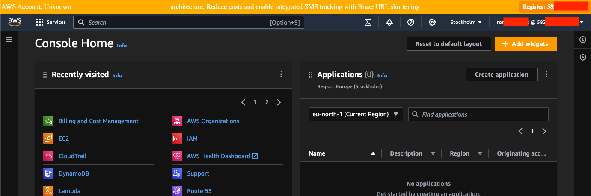
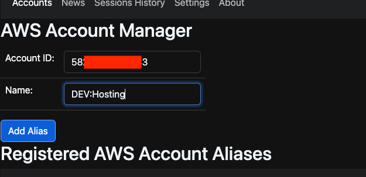
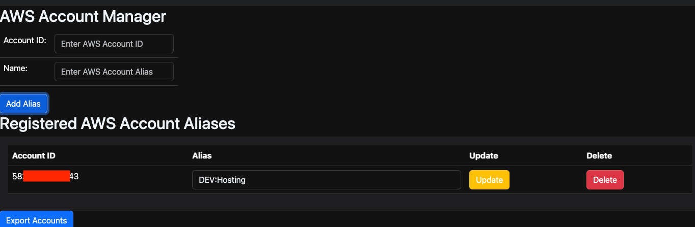
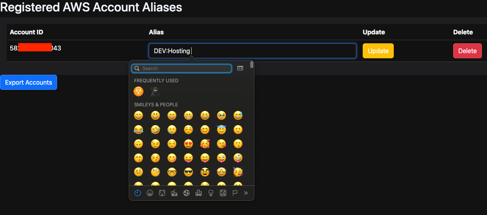
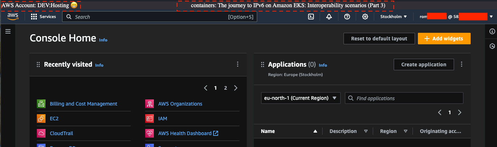
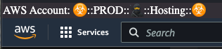
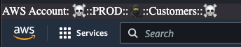

## Table of contents
{: .no_toc .text-delta }

1. TOC
{:toc}

---

# Account Personalization
{: .d-inline-block .no_toc }

Since (v0.0.1)
{: .label .label-red }

One the main goals of ``aws-console-bar`` extension is to help user to have aliases for each AWS account and detect cases when
unknown account is used. This is very useful, especially when you operate with multi-account environment or login to some sandbox environment
during learning or going through course of material.

Not to have situation when you operate with wrong resources in wrong account extension adds additional element into aws console bar, where information is rendered.

## Login into unknown AWS Account

When operating in ``aws-account`` that is not registered in ``aws-console-bar`` it will be rendered with ORANGE color.

## Account Registration

Clicking on ``Register`` button you enter information about this account:

Check all account and edit aliases:

You can use any simbols and emoji when entering the name.
Advise use some naming patter to destinguish environment, scope, application and of course use icons to mark ``DANGER ZONE`` or ``GREEN`` non production accounts:

## Operating in the account that is registered

When account is present in storage - you will not see ``Register account`` button, account name will be rendered at the left top corner.

## Emojis in naming

