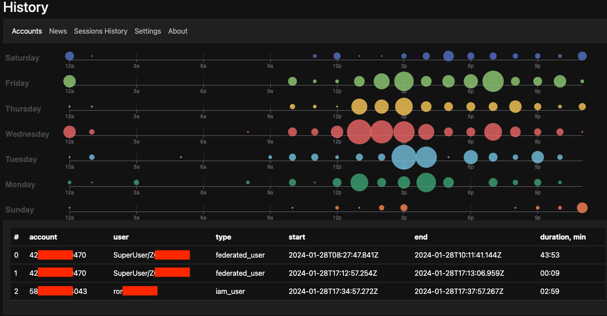

# Usage Statistics
{: .d-inline-block .no_toc }

New (v1.5.0)
{: .label .label-green }

All the data is stored in browser local storage only. ``aws-console-bar`` writes information details about aws account you were logged in
under which IAM role, which region and timing about the session.

On the dashboard you can see the activity though a week period of time with spikes and account switching.